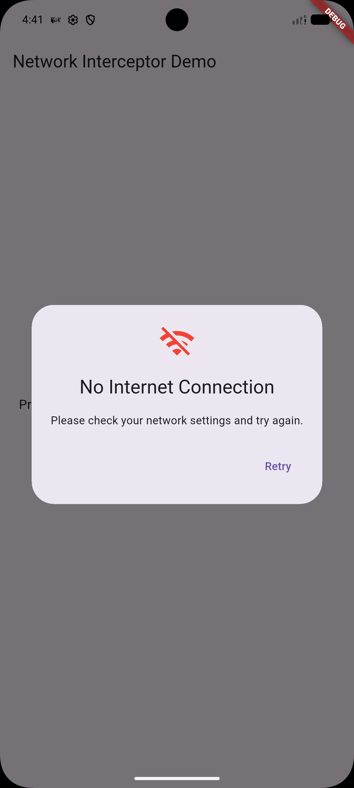
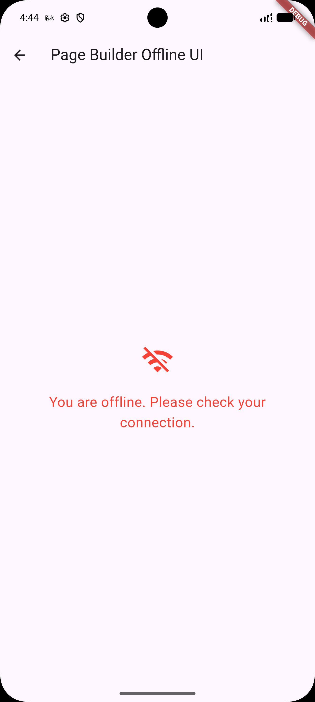
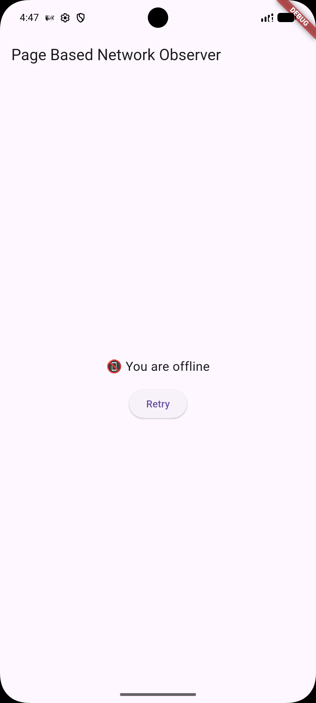

# dio_network_interceptor

[](https://opensource.org/licenses/MIT)

A Dio interceptor that globally handles internet connectivity — blocks requests when offline, catches drops mid-transfer, and shows offline UI automatically.

<p>
  
  &nbsp;&nbsp;
  
  &nbsp;&nbsp;
  
</p>

---

## Features

- **Pre-request check** — blocks requests before they're sent when offline
- **Mid-response check** — catches internet loss while data is being received
- **Typed exceptions** — all Dio errors mapped to `NetworkException` with clear types
- **Global offline UI** — show a dialog or full page automatically via `NetworkObserver`
- **Per-page offline UI** — wrap individual pages with `NetworkAwareWidget`
- **Custom check URIs** — override default connectivity check endpoints

---

## Installation

```yaml
dependencies:
  dio_network_interceptor: ^1.0.0
```

```
flutter pub get
```

---

## Usage

There are **three ways** to handle offline UI — pick what fits your app.

---

### Type 1 — Snackbar (via `onNoInternet` callback)

The simplest approach. Show a snackbar or any custom feedback when a request is blocked.

```dart
import 'package:dio/dio.dart';
import 'package:flutter/material.dart';
import 'package:network_interceptor/network_interceptor.dart';

final dio = Dio();

// Call once — e.g. in initState or a DI setup
void setupDio(BuildContext context) {
  dio.interceptors.add(
    NetworkInterceptor(
      onNoInternet: (requestOptions) async {
        ScaffoldMessenger.of(context).showSnackBar(
          const SnackBar(
            content: Text('📵 No internet connection'),
            backgroundColor: Colors.red,
          ),
        );
      },
      onNetworkError: (exception) {
        debugPrint('[NetworkError] ${exception.type}: ${exception.message}');
      },
    ),
  );
}
```

Catch errors in your repository:

```dart
try {
  final response = await dio.get('/posts');
} on DioException catch (e) {
  if (e.error is NetworkException) {
    final error = e.error as NetworkException;
    switch (error.type) {
      case NetworkErrorType.noInternet:
        // show offline UI
      case NetworkErrorType.timeout:
        // show retry button
      case NetworkErrorType.serverError:
        // use error.statusCode (401, 404, 500...)
      case NetworkErrorType.cancelled:
        // silently ignore
      default:
        // show generic error
    }
  }
}
```

---

### Type 2 — Global dialog or page (`NetworkObserver`)

Wrap your root `MaterialApp` once. A dialog or full page is shown/dismissed
automatically whenever connectivity changes — no per-screen code needed.

#### Setup

```dart
final GlobalKey<NavigatorState> navigatorKey = GlobalKey<NavigatorState>();

void main() => runApp(const MyApp());

class MyApp extends StatelessWidget {
  const MyApp({super.key});

  @override
  Widget build(BuildContext context) {
    return NetworkObserver(
      navigatorKey: navigatorKey,        // required
      // dialogBuilder: ...              // optional — custom dialog
      // pageBuilder: ...                // optional — full offline page
      child: MaterialApp(
        navigatorKey: navigatorKey,      // same key
        home: const HomeScreen(),
      ),
    );
  }
}
```

#### Option A — Default dialog (nothing extra needed)

```dart
NetworkObserver(
  navigatorKey: navigatorKey,
  child: MaterialApp(...),
)
```


#### Option B — Custom dialog

```dart
NetworkObserver(
  navigatorKey: navigatorKey,
  dialogBuilder: (context) => AlertDialog(
    icon: const Icon(Icons.signal_wifi_off, color: Colors.orange, size: 56),
    title: const Text('You\'re Offline'),
    content: const Text('Please reconnect and try again.'),
    actions: [
      TextButton(
        onPressed: () => Navigator.pop(context),
        child: const Text('OK'),
      ),
    ],
  ),
  child: MaterialApp(...),
)
```

#### Option C — Full offline page

```dart
NetworkObserver(
  navigatorKey: navigatorKey,
  pageBuilder: (context) => Scaffold(
    body: Center(
      child: Column(
        mainAxisAlignment: MainAxisAlignment.center,
        children: [
          const Icon(Icons.wifi_off, size: 80, color: Colors.grey),
          const SizedBox(height: 24),
          const Text('You are Offline',
              style: TextStyle(fontSize: 24, fontWeight: FontWeight.bold)),
          const SizedBox(height: 8),
          const Text('Please check your internet connection.'),
        ],
      ),
    ),
  ),
  child: MaterialApp(...),
)
```

> **Note:** `pageBuilder` takes priority over `dialogBuilder` when both are set.

---

### Type 3 — Per-page wrapper (`NetworkAwareWidget`)

Wrap individual pages that need their own offline UI. The child is swapped
inline — no navigation, no dialog. Recovers automatically when internet returns.

```dart
import 'package:network_interceptor/network_interceptor.dart';

class ProductsPage extends StatelessWidget {
  const ProductsPage({super.key});

  @override
  Widget build(BuildContext context) {
    return NetworkAwareWidget(
      // optional — custom offline UI for this page:
      offlineBuilder: (context) => Scaffold(
        appBar: AppBar(title: const Text('Products')),
        body: Center(
          child: Column(
            mainAxisAlignment: MainAxisAlignment.center,
            children: [
              const Icon(Icons.cloud_off, size: 64, color: Colors.orange),
              const SizedBox(height: 16),
              const Text('Products unavailable offline'),
            ],
          ),
        ),
      ),
      child: Scaffold(
        appBar: AppBar(title: const Text('Products')),
        body: const ProductsList(),
      ),
    );
  }
}
```

Default offline UI is shown when `offlineBuilder` is not provided.

---

## Comparison

|                  | Type 1 — Snackbar           | Type 2 — `NetworkObserver`      | Type 3 — `NetworkAwareWidget` |
| ---------------- | --------------------------- | ------------------------------- | ----------------------------- |
| **Scope**        | Per request                 | Whole app                       | Single page                   |
| **UI**           | Snackbar / custom callback  | Dialog or full page             | Inline widget swap            |
| **Setup**        | Add to `dio.interceptors`   | Wrap `MaterialApp` once         | Wrap each page                |
| **Auto-recover** | —                           | ✅                              | ✅                            |
| **Use when**     | Custom feedback per request | Global fallback for all screens | Page-specific offline content |

They can be used **together** — `NetworkObserver` as global fallback, `NetworkAwareWidget` for pages that need a custom offline experience.

---

## Advanced

### Custom connectivity check URIs

By default, the package uses built-in URIs from `internet_connection_checker_plus`.
Override them when your app runs behind a firewall or you want to verify your own backend:

```dart
NetworkInterceptor(
  customCheckOptions: [
    InternetCheckOption(uri: Uri.parse('https://api.yourapp.com/health')),
  ],
)
```

Pass an empty list or omit to use package defaults.

### Disable pre-request or response checks

```dart
NetworkInterceptor(
  checkBeforeRequest: false,  // skip check before sending
  checkOnResponse: false,     // skip check when response arrives
)
```

### Inject a custom `ConnectivityService` (for testing)

```dart
NetworkInterceptor(
  connectivityService: MockConnectivityService(),
)
```

---

## API Reference

### `NetworkInterceptor`

| Parameter             | Type                                     | Default | Description                           |
| --------------------- | ---------------------------------------- | ------- | ------------------------------------- |
| `checkBeforeRequest`  | `bool`                                   | `true`  | Check internet before sending request |
| `checkOnResponse`     | `bool`                                   | `true`  | Check internet when response arrives  |
| `onNoInternet`        | `Future<void> Function(RequestOptions)?` | `null`  | Called when no internet detected      |
| `onNetworkError`      | `void Function(NetworkException)?`       | `null`  | Called for every mapped error         |
| `customCheckOptions`  | `List<InternetCheckOption>?`             | `null`  | Custom URIs for connectivity checks   |
| `connectivityService` | `ConnectivityService?`                   | `null`  | Custom service (useful for testing)   |

### `NetworkObserver`

| Parameter             | Type                        | Required | Description                           |
| --------------------- | --------------------------- | -------- | ------------------------------------- |
| `navigatorKey`        | `GlobalKey<NavigatorState>` | ✅       | Must match `MaterialApp.navigatorKey` |
| `child`               | `Widget`                    | ✅       | Typically `MaterialApp`               |
| `dialogBuilder`       | `WidgetBuilder?`            | —        | Custom offline dialog                 |
| `pageBuilder`         | `WidgetBuilder?`            | —        | Full offline page (takes priority)    |
| `connectivityService` | `ConnectivityService?`      | —        | Custom service (useful for testing)   |

### `NetworkAwareWidget`

| Parameter             | Type                   | Required | Description                                  |
| --------------------- | ---------------------- | -------- | -------------------------------------------- |
| `child`               | `Widget`               | ✅       | Shown when online                            |
| `offlineBuilder`      | `WidgetBuilder?`       | —        | Shown when offline. Falls back to default UI |
| `connectivityService` | `ConnectivityService?` | —        | Custom service (useful for testing)          |

### `NetworkException`

| Property        | Type               | Description                              |
| --------------- | ------------------ | ---------------------------------------- |
| `type`          | `NetworkErrorType` | Category of error                        |
| `message`       | `String`           | Human-readable description               |
| `statusCode`    | `int?`             | HTTP status — only set for `serverError` |
| `isNoInternet`  | `bool`             | Shorthand for `type == noInternet`       |
| `isTimeout`     | `bool`             | Shorthand for `type == timeout`          |
| `isServerError` | `bool`             | Shorthand for `type == serverError`      |

### `NetworkErrorType`

| Value         | Cause                               |
| ------------- | ----------------------------------- |
| `noInternet`  | No active internet connection       |
| `timeout`     | Connect, send, or receive timeout   |
| `serverError` | Non-2xx HTTP response               |
| `cancelled`   | Request cancelled via `CancelToken` |
| `unknown`     | Unrecognized error                  |

---

## Contributing

Contributions are welcome! Feel free to open issues or submit a pull request.
For significant changes, please open an issue first to discuss what you'd like to change.
